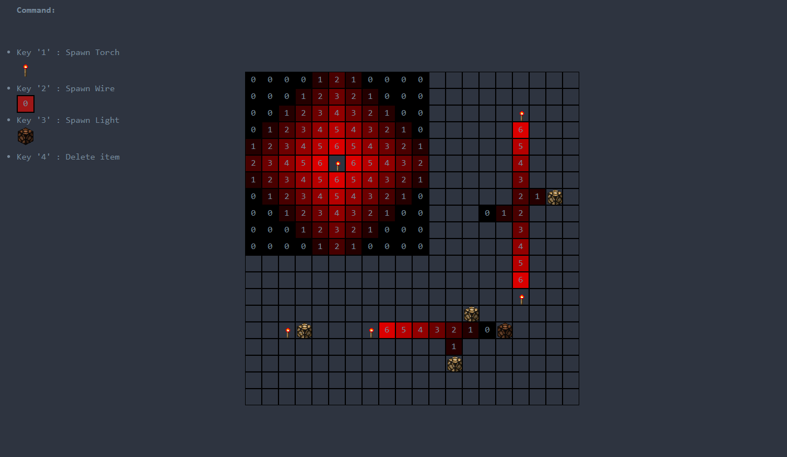

# power_grid

### power_1
The idea is to implement a grid with powered cell.
* A cell can be down, it's signal is equal to zero, or up, it's signal is greather than zero.
* A power up cell, spread it's signal to adjacent cell but loosing power with the distance.
* The cell light fade to black according to it's signal power.
 (The weaker the signal (close to zero) the darker the color)

### power_2
Goal is to recode some redstone behavior from Minecraft
* Torch power up the cell
* Wire detect signal from adjacent cell and spread it, decreasing it's power.
* Light just glow when signal adjacent is greather than zero

